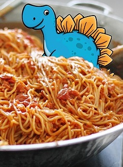

# c4ptur3-th3-fl4g
## Task 1 | Translation & Shifting
### Question 1
- **Guess**: `c4n y0u c4p7u23 7h3 f149?` - *It's readable!*
- **Output**: `can you capture the flag?`
### Question 2
- **Binary**: `01101100 01100101 01110100 01110011 00100000 01110100 01110010 01111001 00100000 01110011 01101111 01101101 01100101 00100000 01100010 01101001 01101110 01100001 01110010 01111001 00100000 01101111 01110101 01110100 00100001`
- **Output**: `lets try some binary out!`
### Question 3
- **Base32**: `MJQXGZJTGIQGS4ZAON2XAZLSEBRW63LNN5XCA2LOEBBVIRRHOM======`
- **Output**: `base32 is super common in CTF's`
### Question 4
- **Base64**: `RWFjaCBCYXNlNjQgZGlnaXQgcmVwcmVzZW50cyBleGFjdGx5IDYgYml0cyBvZiBkYXRhLg==`
- **Output**: `Each Base64 digit represents exactly 6 bits of data.`
### Question 5
- **Hexadecimal**: `68 65 78 61 64 65 63 69 6d 61 6c 20 6f 72 20 62 61 73 65 31 36 3f`
- **Output**: `hexadecimal or base16?`
### Question 6
- **ROT13**: `Ebgngr zr 13 cynprf!`
- **Output**: `Rotate me 13 places!`
### Question 7
- **ROT47**: `*@F DA:? >6 C:89E C@F?5 323J C:89E C@F?5 Wcf E:>6DX`
- **Output**: `You spin me right round baby right round (47 times)`
### Question 8
- **Morse Code**: `- . .-.. . -.-. --- -- -- ..- -. .. -.-. .- - .. --- -.
. -. -.-. --- -.. .. -. --.`
- **Output**: `TELECOMMUNICATION  ENCODING`
### Question 9
- **Decimal**: `85 110 112 97 99 107 32 116 104 105 115 32 66 67 68`
- **Output**: `Unpack this BCD`
### Question 10
#### ROT13 Brute Force
```
LS0tLS0gLi0tLS0gLi0tLS0gLS0tLS0gLS0tLS0gLi0tLS0gLi0tLS0gLS0tLS0KLS0tLS0gLi0tLS0gLi0tLS0gLS0tLS0gLS0tLS0gLi0tLS0gLS0tLS0gLi0tLS0KLS0tLS0gLS0tLS0gLi0tLS0gLS0tLS0gLS0tLS0gLS0tLS0gLS0tLS0gLS0tLS0KLS0tLS0gLi0tLS0gLi0tLS0gLS0tLS0gLS0tLS0gLS0tLS0gLS0tLS0gLS0tLS0KLS0tLS0gLi0tLS0gLS0tLS0gLi0tLS0gLi0tLS0gLi0tLS0gLi0tLS0gLi0tLS0KLS0tLS0gLi0tLS0gLi0tLS0gLS0tLS0gLS0tLS0gLS0tLS0gLS0tLS0gLS0tLS0KLS0tLS0gLS0tLS0gLi0tLS0gLS0tLS0gLS0tLS0gLS0tLS0gLS0tLS0gLS0tLS0KLS0tLS0gLi0tLS0gLi0tLS0gLS0tLS0gLS0tLS0gLS0tLS0gLS0tLS0gLS0tLS0KLS0tLS0gLi0tLS0gLi0tLS0gLS0tLS0gLS0tLS0gLS0tLS0gLS0tLS0gLS0tLS0KLS0tLS0gLi0tLS0gLi0tLS0gLS0tLS0gLS0tLS0gLi0tLS0gLS0tLS0gLi0tLS0KLS0tLS0gLS0tLS0gLi0tLS0gLS0tLS0gLS0tLS0gLS0tLS0gLS0tLS0gLS0tLS0KLS0tLS0gLi0tLS0gLi0tLS0gLS0tLS0gLS0tLS0gLS0tLS0gLi0tLS0gLS0tLS0KLS0tLS0gLi0tLS0gLi0tLS0gLS0tLS0gLi0tLS0gLS0tLS0gLS0tLS0gLS0tLS0KLS0tLS0gLS0tLS0gLi0tLS0gLS0tLS0gLS0tLS0gLS0tLS0gLS0tLS0gLS0tLS0KLS0tLS0gLi0tLS0gLi0tLS0gLS0tLS0gLS0tLS0gLS0tLS0gLS0tLS0gLS0tLS0KLS0tLS0gLi0tLS0gLi0tLS0gLS0tLS0gLS0tLS0gLS0tLS0gLS0tLS0gLS0tLS0KLS0tLS0gLi0tLS0gLi0tLS0gLS0tLS0gLS0tLS0gLi0tLS0gLS0tLS0gLS0tLS0KLS0tLS0gLS0tLS0gLi0tLS0gLS0tLS0gLS0tLS0gLS0tLS0gLS0tLS0gLS0tLS0KLS0tLS0gLi0tLS0gLi0tLS0gLS0tLS0gLS0tLS0gLS0tLS0gLi0tLS0gLS0tLS0KLS0tLS0gLi0tLS0gLi0tLS0gLS0tLS0gLS0tLS0gLS0tLS0gLS0tLS0gLi0tLS0KLS0tLS0gLS0tLS0gLi0tLS0gLS0tLS0gLS0tLS0gLS0tLS0gLS0tLS0gLS0tLS0KLS0tLS0gLi0tLS0gLi0tLS0gLS0tLS0gLS0tLS0gLS0tLS0gLS0tLS0gLS0tLS0KLS0tLS0gLi0tLS0gLS0tLS0gLi0tLS0gLi0tLS0gLi0tLS0gLi0tLS0gLi0tLS0KLS0tLS0gLi0tLS0gLi0tLS0gLS0tLS0gLi0tLS0gLS0tLS0gLS0tLS0gLS0tLS0KLS0tLS0gLS0tLS0gLi0tLS0gLS0tLS0gLS0tLS0gLS0tLS0gLS0tLS0gLS0tLS0KLS0tLS0gLi0tLS0gLi0tLS0gLS0tLS0gLi0tLS0gLS0tLS0gLS0tLS0gLS0tLS0KLS0tLS0gLi0tLS0gLi0tLS0gLS0tLS0gLS0tLS0gLi0tLS0gLi0tLS0gLS0tLS0KLS0tLS0gLS0tLS0gLi0tLS0gLS0tLS0gLS0tLS0gLS0tLS0gLS0tLS0gLS0tLS0KLS0tLS0gLi0tLS0gLi0tLS0gLS0tLS0gLS0tLS0gLS0tLS0gLS0tLS0gLS0tLS0KLS0tLS0gLi0tLS0gLS0tLS0gLi0tLS0gLi0tLS0gLi0tLS0gLi0tLS0gLi0tLS0KLS0tLS0gLi0tLS0gLi0tLS0gLS0tLS0gLS0tLS0gLi0tLS0gLi0tLS0gLS0tLS0KLS0tLS0gLS0tLS0gLi0tLS0gLS0tLS0gLS0tLS0gLS0tLS0gLS0tLS0gLS0tLS0KLS0tLS0gLi0tLS0gLi0tLS0gLS0tLS0gLS0tLS0gLS0tLS0gLS0tLS0gLS0tLS0KLS0tLS0gLi0tLS0gLS0tLS0gLi0tLS0gLi0tLS0gLi0tLS0gLi0tLS0gLi0tLS0KLS0tLS0gLi0tLS0gLi0tLS0gLS0tLS0gLS0tLS0gLS0tLS0gLS0tLS0gLS0tLS0KLS0tLS0gLS0tLS0gLi0tLS0gLS0tLS0gLS0tLS0gLS0tLS0gLS0tLS0gLS0tLS0KLS0tLS0gLi0tLS0gLi0tLS0gLS0tLS0gLS0tLS0gLS0tLS0gLi0tLS0gLS0tLS0KLS0tLS0gLi0tLS0gLi0tLS0gLS0tLS0gLS0tLS0gLS0tLS0gLS0tLS0gLi0tLS0KLS0tLS0gLS0tLS0gLi0tLS0gLS0tLS0gLS0tLS0gLS0tLS0gLS0tLS0gLS0tLS0KLS0tLS0gLi0tLS0gLi0tLS0gLS0tLS0gLS0tLS0gLS0tLS0gLS0tLS0gLS0tLS0KLS0tLS0gLi0tLS0gLi0tLS0gLS0tLS0gLS0tLS0gLS0tLS0gLS0tLS0gLS0tLS0KLS0tLS0gLi0tLS0gLi0tLS0gLS0tLS0gLS0tLS0gLi0tLS0gLS0tLS0gLi0tLS0KLS0tLS0gLS0tLS0gLi0tLS0gLS0tLS0gLS0tLS0gLS0tLS0gLS0tLS0gLS0tLS0KLS0tLS0gLi0tLS0gLi0tLS0gLS0tLS0gLS0tLS0gLS0tLS0gLS0tLS0gLS0tLS0KLS0tLS0gLi0tLS0gLS0tLS0gLi0tLS0gLi0tLS0gLi0tLS0gLi0tLS0gLi0tLS0KLS0tLS0gLi0tLS0gLi0tLS0gLS0tLS0gLS0tLS0gLS0tLS0gLi0tLS0gLi0tLS0KLS0tLS0gLS0tLS0gLi0tLS0gLS0tLS0gLS0tLS0gLS0tLS0gLS0tLS0gLS0tLS0KLS0tLS0gLi0tLS0gLi0tLS0gLS0tLS0gLS0tLS0gLS0tLS0gLS0tLS0gLS0tLS0KLS0tLS0gLi0tLS0gLS0tLS0gLi0tLS0gLi0tLS0gLi0tLS0gLi0tLS0gLi0tLS0KLS0tLS0gLi0tLS0gLi0tLS0gLS0tLS0gLS0tLS0gLi0tLS0gLS0tLS0gLS0tLS0KLS0tLS0gLS0tLS0gLi0tLS0gLS0tLS0gLS0tLS0gLS0tLS0gLS0tLS0gLS0tLS0KLS0tLS0gLi0tLS0gLi0tLS0gLS0tLS0gLS0tLS0gLS0tLS0gLS0tLS0gLS0tLS0KLS0tLS0gLi0tLS0gLi0tLS0gLS0tLS0gLS0tLS0gLS0tLS0gLS0tLS0gLS0tLS0KLS0tLS0gLi0tLS0gLi0tLS0gLS0tLS0gLS0tLS0gLi0tLS0gLS0tLS0gLS0tLS0KLS0tLS0gLS0tLS0gLi0tLS0gLS0tLS0gLS0tLS0gLS0tLS0gLS0tLS0gLS0tLS0KLS0tLS0gLi0tLS0gLi0tLS0gLS0tLS0gLS0tLS0gLS0tLS0gLi0tLS0gLS0tLS0KLS0tLS0gLi0tLS0gLi0tLS0gLS0tLS0gLS0tLS0gLS0tLS0gLS0tLS0gLi0tLS0KLS0tLS0gLS0tLS0gLi0tLS0gLS0tLS0gLS0tLS0gLS0tLS0gLS0tLS0gLS0tLS0KLS0tLS0gLi0tLS0gLi0tLS0gLS0tLS0gLi0tLS0gLS0tLS0gLS0tLS0gLS0tLS0KLS0tLS0gLi0tLS0gLi0tLS0gLS0tLS0gLS0tLS0gLi0tLS0gLi0tLS0gLS0tLS0KLS0tLS0gLS0tLS0gLi0tLS0gLS0tLS0gLS0tLS0gLS0tLS0gLS0tLS0gLS0tLS0KLS0tLS0gLi0tLS0gLi0tLS0gLS0tLS0gLS0tLS0gLS0tLS0gLi0tLS0gLS0tLS0KLS0tLS0gLi0tLS0gLi0tLS0gLS0tLS0gLS0tLS0gLS0tLS0gLS0tLS0gLi0tLS0KLS0tLS0gLS0tLS0gLi0tLS0gLS0tLS0gLS0tLS0gLS0tLS0gLS0tLS0gLS0tLS0KLS0tLS0gLi0tLS0gLi0tLS0gLS0tLS0gLi0tLS0gLS0tLS0gLS0tLS0gLS0tLS0KLS0tLS0gLi0tLS0gLi0tLS0gLS0tLS0gLS0tLS0gLi0tLS0gLi0tLS0gLi0tLS0KLS0tLS0gLS0tLS0gLi0tLS0gLS0tLS0gLS0tLS0gLS0tLS0gLS0tLS0gLS0tLS0KLS0tLS0gLi0tLS0gLi0tLS0gLS0tLS0gLS0tLS0gLS0tLS0gLS0tLS0gLS0tLS0KLS0tLS0gLi0tLS0gLS0tLS0gLi0tLS0gLi0tLS0gLi0tLS0gLi0tLS0gLi0tLS0KLS0tLS0gLi0tLS0gLi0tLS0gLS0tLS0gLS0tLS0gLi0tLS0gLS0tLS0gLS0tLS0KLS0tLS0gLS0tLS0gLi0tLS0gLS0tLS0gLS0tLS0gLS0tLS0gLS0tLS0gLS0tLS0KLS0tLS0gLi0tLS0gLi0tLS0gLS0tLS0gLS0tLS0gLS0tLS0gLS0tLS0gLS0tLS0KLS0tLS0gLi0tLS0gLi0tLS0gLS0tLS0gLS0tLS0gLS0tLS0gLS0tLS0gLS0tLS0KLS0tLS0gLi0tLS0gLi0tLS0gLS0tLS0gLS0tLS0gLi0tLS0gLS0tLS0gLi0tLS0KLS0tLS0gLS0tLS0gLi0tLS0gLS0tLS0gLS0tLS0gLS0tLS0gLS0tLS0gLS0tLS0KLS0tLS0gLi0tLS0gLi0tLS0gLS0tLS0gLS0tLS0gLS0tLS0gLi0tLS0gLS0tLS0KLS0tLS0gLi0tLS0gLi0tLS0gLS0tLS0gLS0tLS0gLS0tLS0gLS0tLS0gLi0tLS0KLS0tLS0gLS0tLS0gLi0tLS0gLS0tLS0gLS0tLS0gLS0tLS0gLS0tLS0gLS0tLS0KLS0tLS0gLi0tLS0gLi0tLS0gLS0tLS0gLS0tLS0gLS0tLS0gLS0tLS0gLS0tLS0KLS0tLS0gLi0tLS0gLi0tLS0gLS0tLS0gLS0tLS0gLS0tLS0gLS0tLS0gLS0tLS0KLS0tLS0gLi0tLS0gLi0tLS0gLS0tLS0gLS0tLS0gLi0tLS0gLS0tLS0gLi0tLS0KLS0tLS0gLS0tLS0gLi0tLS0gLS0tLS0gLS0tLS0gLS0tLS0gLS0tLS0gLS0tLS0KLS0tLS0gLi0tLS0gLi0tLS0gLS0tLS0gLS0tLS0gLS0tLS0gLS0tLS0gLS0tLS0KLS0tLS0gLi0tLS0gLi0tLS0gLS0tLS0gLS0tLS0gLS0tLS0gLS0tLS0gLS0tLS0KLS0tLS0gLi0tLS0gLi0tLS0gLS0tLS0gLS0tLS0gLS0tLS0gLi0tLS0gLi0tLS0KLS0tLS0gLS0tLS0gLi0tLS0gLS0tLS0gLS0tLS0gLS0tLS0gLS0tLS0gLS0tLS0KLS0tLS0gLi0tLS0gLi0tLS0gLS0tLS0gLS0tLS0gLS0tLS0gLS0tLS0gLS0tLS0KLS0tLS0gLi0tLS0gLS0tLS0gLi0tLS0gLi0tLS0gLi0tLS0gLi0tLS0gLi0tLS0KLS0tLS0gLi0tLS0gLi0tLS0gLS0tLS0gLS0tLS0gLi0tLS0gLS0tLS0gLS0tLS0KLS0tLS0gLS0tLS0gLi0tLS0gLS0tLS0gLS0tLS0gLS0tLS0gLS0tLS0gLS0tLS0KLS0tLS0gLi0tLS0gLi0tLS0gLS0tLS0gLi0tLS0gLS0tLS0gLS0tLS0gLS0tLS0KLS0tLS0gLi0tLS0gLi0tLS0gLS0tLS0gLi0tLS0gLS0tLS0gLS0tLS0gLS0tLS0KLS0tLS0gLS0tLS0gLi0tLS0gLS0tLS0gLS0tLS0gLS0tLS0gLS0tLS0gLS0tLS0KLS0tLS0gLi0tLS0gLi0tLS0gLS0tLS0gLS0tLS0gLS0tLS0gLS0tLS0gLS0tLS0KLS0tLS0gLi0tLS0gLS0tLS0gLi0tLS0gLi0tLS0gLi0tLS0gLi0tLS0gLi0tLS0KLS0tLS0gLi0tLS0gLi0tLS0gLS0tLS0gLS0tLS0gLi0tLS0gLi0tLS0gLS0tLS0KLS0tLS0gLS0tLS0gLi0tLS0gLS0tLS0gLS0tLS0gLS0tLS0gLS0tLS0gLS0tLS0KLS0tLS0gLi0tLS0gLi0tLS0gLS0tLS0gLS0tLS0gLS0tLS0gLS0tLS0gLS0tLS0KLS0tLS0gLi0tLS0gLS0tLS0gLi0tLS0gLi0tLS0gLi0tLS0gLi0tLS0gLi0tLS0KLS0tLS0gLi0tLS0gLi0tLS0gLS0tLS0gLS0tLS0gLi0tLS0gLS0tLS0gLS0tLS0KLS0tLS0gLS0tLS0gLi0tLS0gLS0tLS0gLS0tLS0gLS0tLS0gLS0tLS0gLS0tLS0KLS0tLS0gLi0tLS0gLi0tLS0gLS0tLS0gLS0tLS0gLS0tLS0gLS0tLS0gLS0tLS0KLS0tLS0gLi0tLS0gLS0tLS0gLi0tLS0gLi0tLS0gLi0tLS0gLi0tLS0gLi0tLS0KLS0tLS0gLi0tLS0gLi0tLS0gLS0tLS0gLS0tLS0gLS0tLS0gLS0tLS0gLS0tLS0KLS0tLS0gLS0tLS0gLi0tLS0gLS0tLS0gLS0tLS0gLS0tLS0gLS0tLS0gLS0tLS0KLS0tLS0gLi0tLS0gLi0tLS0gLS0tLS0gLS0tLS0gLS0tLS0gLS0tLS0gLS0tLS0KLS0tLS0gLi0tLS0gLi0tLS0gLS0tLS0gLS0tLS0gLS0tLS0gLS0tLS0gLS0tLS0KLS0tLS0gLi0tLS0gLi0tLS0gLS0tLS0gLS0tLS0gLS0tLS0gLi0tLS0gLi0tLS0KLS0tLS0gLS0tLS0gLi0tLS0gLS0tLS0gLS0tLS0gLS0tLS0gLS0tLS0gLS0tLS0KLS0tLS0gLi0tLS0gLi0tLS0gLS0tLS0gLS0tLS0gLS0tLS0gLi0tLS0gLi0tLS0KLS0tLS0gLi0tLS0gLi0tLS0gLS0tLS0gLS0tLS0gLi0tLS0gLS0tLS0gLi0tLS0KLS0tLS0gLS0tLS0gLi0tLS0gLS0tLS0gLS0tLS0gLS0tLS0gLS0tLS0gLS0tLS0KLS0tLS0gLi0tLS0gLi0tLS0gLS0tLS0gLS0tLS0gLS0tLS0gLi0tLS0gLi0tLS0KLS0tLS0gLi0tLS0gLi0tLS0gLS0tLS0gLS0tLS0gLi0tLS0gLS0tLS0gLi0tLS0KLS0tLS0gLS0tLS0gLi0tLS0gLS0tLS0gLS0tLS0gLS0tLS0gLS0tLS0gLS0tLS0KLS0tLS0gLi0tLS0gLi0tLS0gLS0tLS0gLS0tLS0gLS0tLS0gLi0tLS0gLi0tLS0KLS0tLS0gLi0tLS0gLi0tLS0gLS0tLS0gLS0tLS0gLi0tLS0gLS0tLS0gLi0tLS0=
```
#### Morse Code
```
----- .---- .---- ----- ----- .---- .---- -----
----- .---- .---- ----- ----- .---- ----- .----
----- ----- .---- ----- ----- ----- ----- -----
----- .---- .---- ----- ----- ----- ----- -----
----- .---- ----- .---- .---- .---- .---- .----
----- .---- .---- ----- ----- ----- ----- -----
----- ----- .---- ----- ----- ----- ----- -----
----- .---- .---- ----- ----- ----- ----- -----
----- .---- .---- ----- ----- ----- ----- -----
----- .---- .---- ----- ----- .---- ----- .----
----- ----- .---- ----- ----- ----- ----- -----
----- .---- .---- ----- ----- ----- .---- -----
----- .---- .---- ----- .---- ----- ----- -----
----- ----- .---- ----- ----- ----- ----- -----
----- .---- .---- ----- ----- ----- ----- -----
----- .---- .---- ----- ----- ----- ----- -----
----- .---- .---- ----- ----- .---- ----- -----
----- ----- .---- ----- ----- ----- ----- -----
----- .---- .---- ----- ----- ----- .---- -----
----- .---- .---- ----- ----- ----- ----- .----
----- ----- .---- ----- ----- ----- ----- -----
----- .---- .---- ----- ----- ----- ----- -----
----- .---- ----- .---- .---- .---- .---- .----
----- .---- .---- ----- .---- ----- ----- -----
----- ----- .---- ----- ----- ----- ----- -----
----- .---- .---- ----- .---- ----- ----- -----
----- .---- .---- ----- ----- .---- .---- -----
----- ----- .---- ----- ----- ----- ----- -----
----- .---- .---- ----- ----- ----- ----- -----
----- .---- ----- .---- .---- .---- .---- .----
----- .---- .---- ----- ----- .---- .---- -----
----- ----- .---- ----- ----- ----- ----- -----
----- .---- .---- ----- ----- ----- ----- -----
----- .---- ----- .---- .---- .---- .---- .----
----- .---- .---- ----- ----- ----- ----- -----
----- ----- .---- ----- ----- ----- ----- -----
----- .---- .---- ----- ----- ----- .---- -----
----- .---- .---- ----- ----- ----- ----- .----
----- ----- .---- ----- ----- ----- ----- -----
----- .---- .---- ----- ----- ----- ----- -----
----- .---- .---- ----- ----- ----- ----- -----
----- .---- .---- ----- ----- .---- ----- .----
----- ----- .---- ----- ----- ----- ----- -----
----- .---- .---- ----- ----- ----- ----- -----
----- .---- ----- .---- .---- .---- .---- .----
----- .---- .---- ----- ----- ----- .---- .----
----- ----- .---- ----- ----- ----- ----- -----
----- .---- .---- ----- ----- ----- ----- -----
----- .---- ----- .---- .---- .---- .---- .----
----- .---- .---- ----- ----- .---- ----- -----
----- ----- .---- ----- ----- ----- ----- -----
----- .---- .---- ----- ----- ----- ----- -----
----- .---- .---- ----- ----- ----- ----- -----
----- .---- .---- ----- ----- .---- ----- -----
----- ----- .---- ----- ----- ----- ----- -----
----- .---- .---- ----- ----- ----- .---- -----
----- .---- .---- ----- ----- ----- ----- .----
----- ----- .---- ----- ----- ----- ----- -----
----- .---- .---- ----- .---- ----- ----- -----
----- .---- .---- ----- ----- .---- .---- -----
----- ----- .---- ----- ----- ----- ----- -----
----- .---- .---- ----- ----- ----- .---- -----
----- .---- .---- ----- ----- ----- ----- .----
----- ----- .---- ----- ----- ----- ----- -----
----- .---- .---- ----- .---- ----- ----- -----
----- .---- .---- ----- ----- .---- .---- .----
----- ----- .---- ----- ----- ----- ----- -----
----- .---- .---- ----- ----- ----- ----- -----
----- .---- ----- .---- .---- .---- .---- .----
----- .---- .---- ----- ----- .---- ----- -----
----- ----- .---- ----- ----- ----- ----- -----
----- .---- .---- ----- ----- ----- ----- -----
----- .---- .---- ----- ----- ----- ----- -----
----- .---- .---- ----- ----- .---- ----- .----
----- ----- .---- ----- ----- ----- ----- -----
----- .---- .---- ----- ----- ----- .---- -----
----- .---- .---- ----- ----- ----- ----- .----
----- ----- .---- ----- ----- ----- ----- -----
----- .---- .---- ----- ----- ----- ----- -----
----- .---- .---- ----- ----- ----- ----- -----
----- .---- .---- ----- ----- .---- ----- .----
----- ----- .---- ----- ----- ----- ----- -----
----- .---- .---- ----- ----- ----- ----- -----
----- .---- .---- ----- ----- ----- ----- -----
----- .---- .---- ----- ----- ----- .---- .----
----- ----- .---- ----- ----- ----- ----- -----
----- .---- .---- ----- ----- ----- ----- -----
----- .---- ----- .---- .---- .---- .---- .----
----- .---- .---- ----- ----- .---- ----- -----
----- ----- .---- ----- ----- ----- ----- -----
----- .---- .---- ----- .---- ----- ----- -----
----- .---- .---- ----- .---- ----- ----- -----
----- ----- .---- ----- ----- ----- ----- -----
----- .---- .---- ----- ----- ----- ----- -----
----- .---- ----- .---- .---- .---- .---- .----
----- .---- .---- ----- ----- .---- .---- -----
----- ----- .---- ----- ----- ----- ----- -----
----- .---- .---- ----- ----- ----- ----- -----
----- .---- ----- .---- .---- .---- .---- .----
----- .---- .---- ----- ----- .---- ----- -----
----- ----- .---- ----- ----- ----- ----- -----
----- .---- .---- ----- ----- ----- ----- -----
----- .---- ----- .---- .---- .---- .---- .----
----- .---- .---- ----- ----- ----- ----- -----
----- ----- .---- ----- ----- ----- ----- -----
----- .---- .---- ----- ----- ----- ----- -----
----- .---- .---- ----- ----- ----- ----- -----
----- .---- .---- ----- ----- ----- .---- .----
----- ----- .---- ----- ----- ----- ----- -----
----- .---- .---- ----- ----- ----- .---- .----
----- .---- .---- ----- ----- .---- ----- .----
----- ----- .---- ----- ----- ----- ----- -----
----- .---- .---- ----- ----- ----- .---- .----
----- .---- .---- ----- ----- .---- ----- .----
----- ----- .---- ----- ----- ----- ----- -----
----- .---- .---- ----- ----- ----- .---- .----
----- .---- .---- ----- ----- .---- ----- .----
```
#### Binary
```
01100110 01100101 00100000 01100000 01011111 01100000 00100000 01100000 01100000 01100101 00100000 01100010 01101000 00100000 01100000 01100000 01100100 00100000 01100010 01100001 00100000 01100000 01011111 01101000 00100000 01101000 01100110 00100000 01100000 01011111 01100110 00100000 01100000 01011111 01100000 00100000 01100010 01100001 00100000 01100000 01100000 01100101 00100000 01100000 01011111 01100011 00100000 01100000 01011111 01100100 00100000 01100000 01100000 01100100 00100000 01100010 01100001 00100000 01101000 01100110 00100000 01100010 01100001 00100000 01101000 01100111 00100000 01100000 01011111 01100100 00100000 01100000 01100000 01100101 00100000 01100010 01100001 00100000 01100000 01100000 01100101 00100000 01100000 01100000 01100011 00100000 01100000 01011111 01100100 00100000 01101000 01101000 00100000 01100000 01011111 01100110 00100000 01100000 01011111 01100100 00100000 01100000 01011111 01100000 00100000 01100000 01100000 01100011 00100000 01100011 01100101 00100000 01100011 01100101 00100000 01100011 01100101
```
#### ROT47
```
fe `_` ``e bh ``d ba `_h hf `_f `_` ba ``e `_c `_d ``d ba hf ba hg `_d ``e ba ``e ``c `_d hh `_f `_d `_` ``c ce ce ce
```
#### Decimal
```
76 101 116 39 115 32 109 97 107 101 32 116 104 105 115 32 97 32 98 105 116 32 116 114 105 99 107 105 101 114 46 46 46
```
#### Output
```
Let's make this a bit trickier...
```

## Task 2 | Spectrograms
1. **Download**: `Audacity`
2. **Select spectrogram**

To choose Spectrogram view, click the track name (or the black triangle) in the Track Control Panel. This will bring up the Track Dropdown Menu, where you can choose the desired view (*Spectrogram View - Audacity Manual*, n.d.).

3. Found message: `Super Secret Message`

## Task 3 | Steganography


`SpaghettiSteg`

## Task 4 | Security through obscurity

### Question 1
1. `Download and get 'inside' the file. What is the first filename & extension?`
1. `strings meme_1559010886025.jpg`
1. `hackerchat.png`

### Question 2
1. `Get inside the archive and inspect the file carefully. Find the hidden text.`
1. `strings meme_1559010886025.jpg`
1. `AHH_YOU_FOUND_ME!`