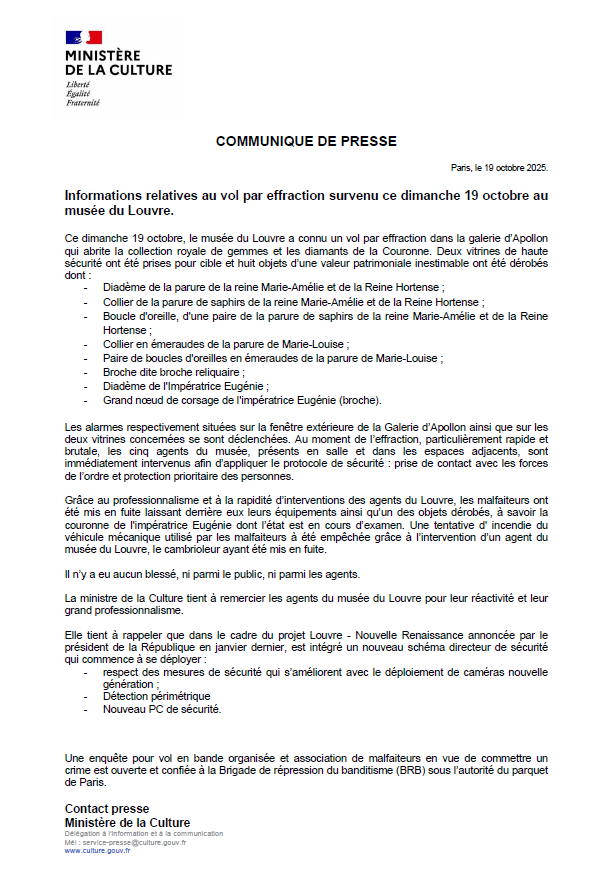
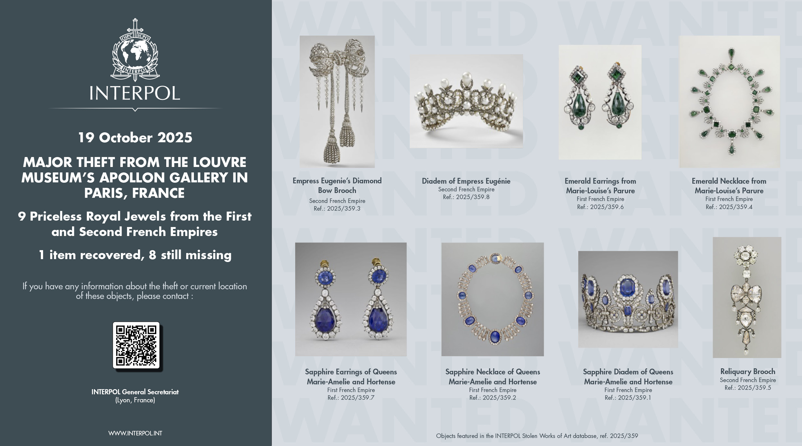

# The Case: Seven Minutes on the Seine
### Notes
- Gather and verify information from public sources: `museum pages`, `heritage archives`, `news coverage`, `social media`, and `open databases`.
## Tasl 1 | Louvre
### Q1
```diff
Which museum entrance by name is on the river side lines up where the ladder truck was positioned?

Give the entrance name and the official closure date for that entrance as stated by the museum.

+Answer format: <ENTRANCE_NAME>-<DD_MMM_YYYY>

+PORTE_DES_LIONS-22_OCT_2024
```
- [Official closure tweet 1](https://x.com/MuseeLouvre/status/1979829326112858152)
- [Official closure tweet 2](https://x.com/MuseeLouvre/status/1979953900279984344)
- [Official closure Linkedin post](https://fr.linkedin.com/posts/musee-du-louvre_communique-de-presse-dimanche-19-octobre-activity-7385720372123570176-T-tM)
- [YT - Video](https://www.youtube.com/watch?v=4NsAMEKcawA)


### Q2
For Empress Eugénie's Reliquary Brooch, report:
* The official `Inventory Number`
* The surname of the `maker` (as named by the museum)
* The acquisition mode + year (e.g., assigned/purchased + year)
* The item's `Current Location` status on its record.
```diff
+ Format: <INV>-<MAKER>-<MODE>-<YEAR>-<STATUS>
+Example: OA1234-NAME-AFFECTE-1887-NON_EXPOSE
+MV1024-BAPST-AFFECTE-1887-NON_EXPOSE
```
[louvre collections | Broche dite broche reliquaire](https://collections.louvre.fr/en/ark:/53355/cl010103123)
### Q3
Two of the stolen pieces received INTERPOL reference IDs on the public poster / database. What are the INTERPOL reference IDs for the `Sapphire Diadem of Queens Marie-Amélie and Hortense`, and the `Reliquary Brooch`?


```diff
+2025/359.1,2025/359.5
```
### Q4
Give the `title`, `inventory number`, and `dimensions` of the central ceiling painting in the Galerie d'Apollon.

Painting name: `Apollo Slaying the Serpent Python`

```diff
+apollon_vainqueur-INV_3818-8mx7.5m
```
[louvre collections | Apollon vainqueur du serpent Python](https://collections.louvre.fr/en/ark:/53355/cl010065703)
### Q5
```diff
What bridge lies directly south of the river-side nearest the aforementioned entrance?

Answer format: BRIDGE_NAME
+Pont_Royal
```
### Flag!
```diff
+THM{n1c3_h31st_r3s34rch}
```
## Task 2 | 
louvre
louvre.
```diff
+THM{cctv_4ud1ts_4r3_fun} 
```