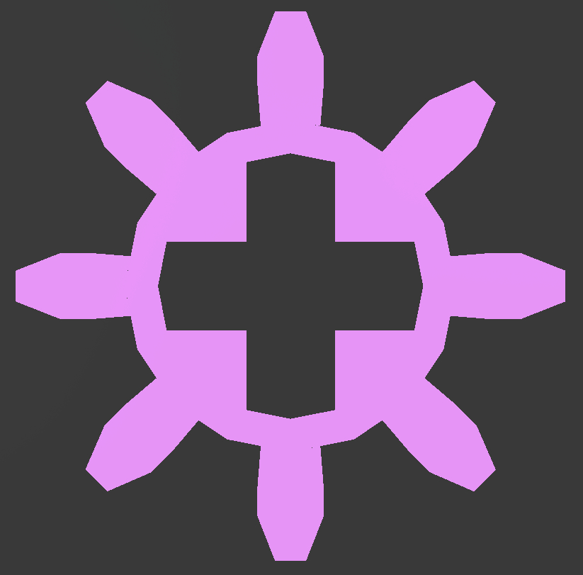
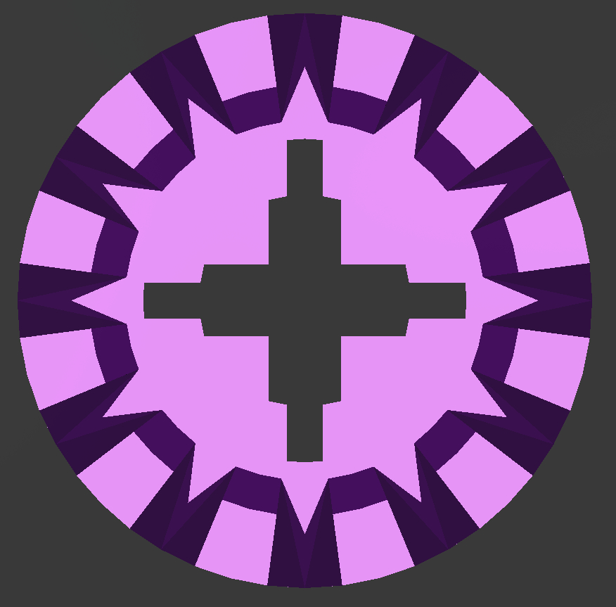
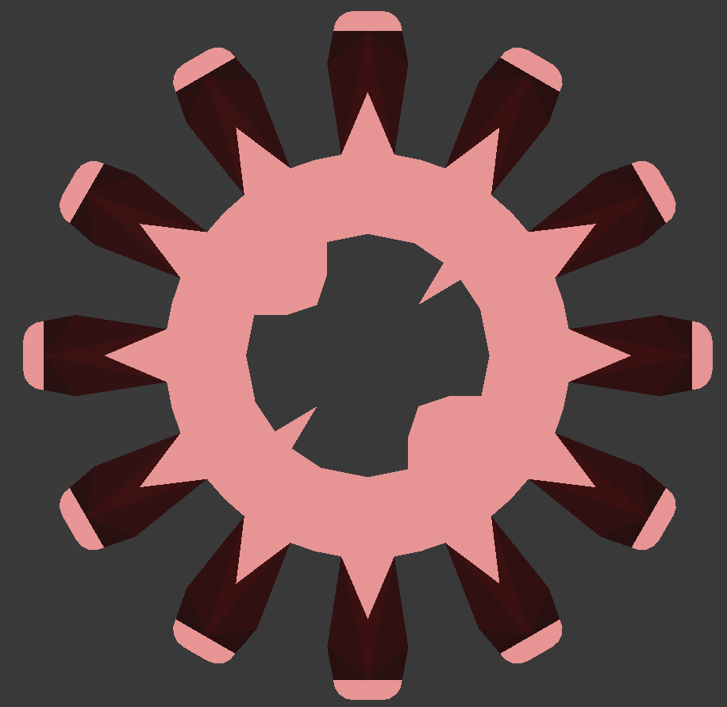
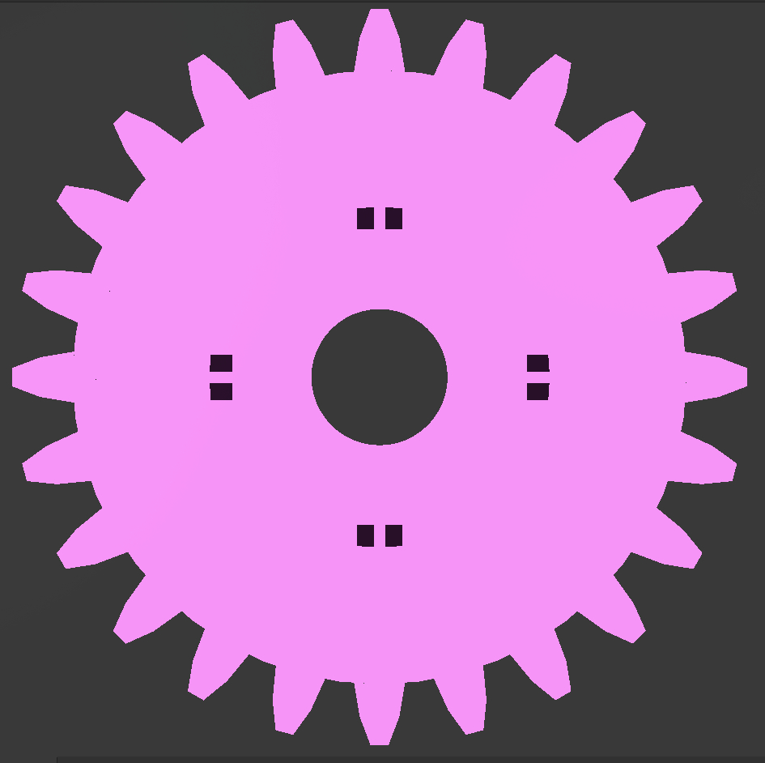
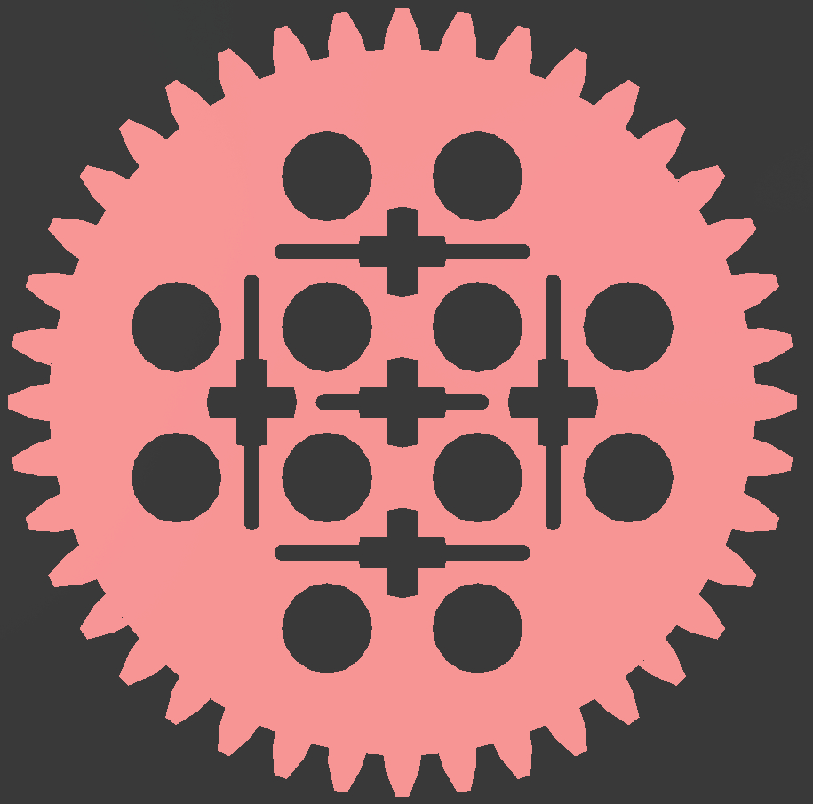

Files
- `input.txt`
    - `VirtualMachine1.dae`, **Digital Asset Exchange**

Tips
- Get past the checker program, `nc saturn.picoctf.net ?????`
- Used [Mayo](https://github.com/fougue/mayo) to view the `VirtualMachine1.dae`, **Digital Asset Exchange**

- Axles & Cogs
    - **8 Cogs**
        1. X23 Axles - [Points: 264, Edges: 720, Faces: 448]
        
    - **12 Cogs**
        1. X32 Axles - [Points: 668, Edges: 1972, Faces: 1220]
        
        1. X8 Axles - [Points: 728, Edges: 2028, Faces: 1176]
        
    - **16 Cogs**
        1. 11X Axles - [Points: 1344, Edges: 2592, Faces: 1256]
        
    - **24 Cogs**
        1. 1X Axles - [Points: 1652, Edges: 4268, Faces: 2536]
        
        1. 4X Axles - [Points: 2931, Edges: 7170, Faces: 4268]
        
        1. 4X Axles - [Points: 1648, Edges: 4264, Faces: 2536]
        
        1. 1X Axles - [Points: 1636, Edges: 4260, Faces: 2536]
        
        1. 1X Axles - [Points: 1624, Edges: 4244, Faces: 2536]
        
        1. 2X Axles - [Points: 1628, Edges: 4252, Faces: 2536]
        
    - **40 Cogs**
        - 2x Axles - [Points: 3972, Edges: 9010, Faces: 5004]
        