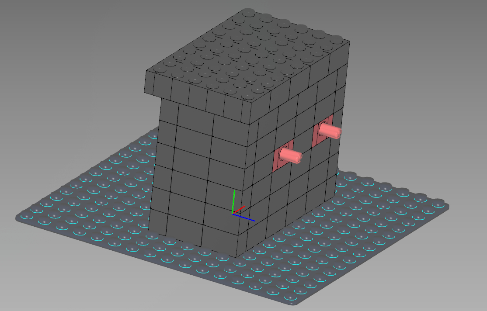

- [Virtual Machine 0](#virtual-machine-0)

## Virtual Machine 0
Files
- `input.txt`
- `Virtual-Machine-0.zip`
    - `Virtual-Machine-0.dae`, **Digital Asset Exchange**

Tips
- Red axle
    - Input
    - 40 Cogs
- Blue axle
    - Output
    - 8 Cogs

Images
- Without edit 
- With edit 

```sh
# input.txt
input=39722847074734820757600524178581224432297292490103995908738058203639164185

# Red axle 40 Cogs | Blue axle 8 Cogs
diff=$(( 40/8 ))

# Num
num=$( calc $input*$diff )

# Hex
hex=$( echo "obase=16; $num" | bc )

# Flag
echo $hex | xxd -r -p
```